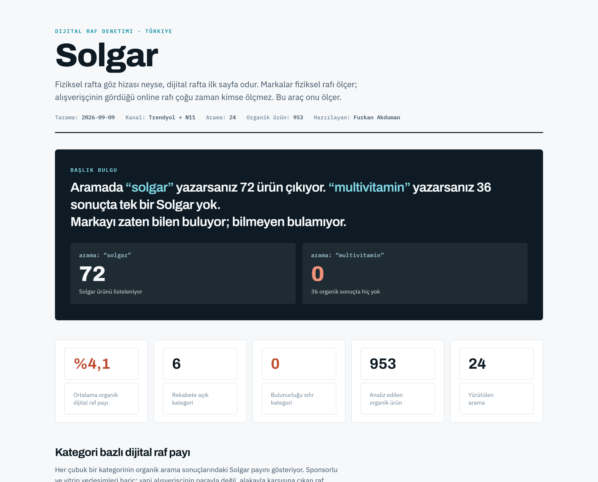
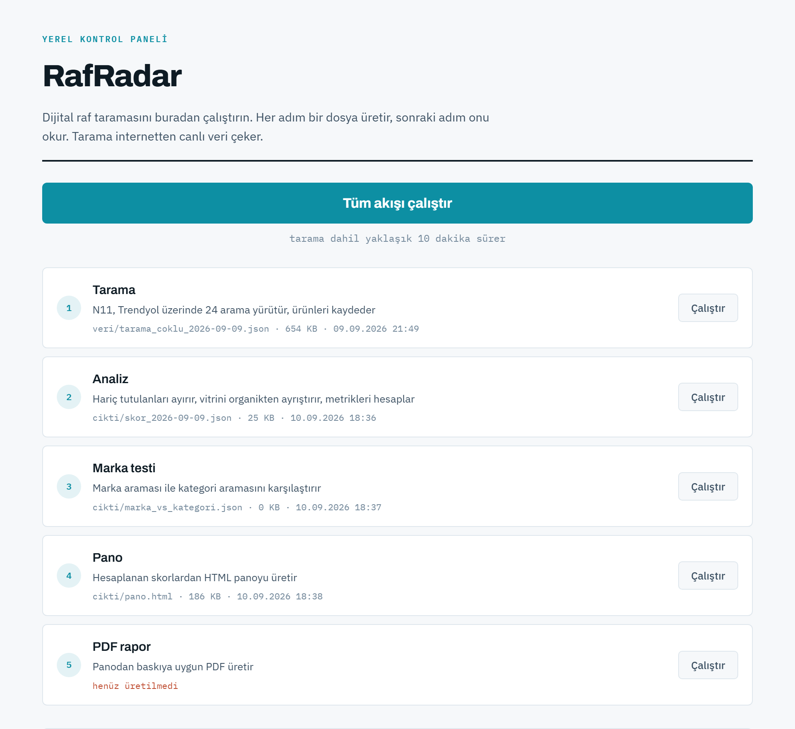

# RafRadar

[](LICENSE)
[](https://www.python.org/)
[](#channels)
[](#requirements)
[](https://github.com/FlyerFukas/rafradar/actions/workflows/testler.yml)

**Digital shelf audit for e-commerce search results.** Retail teams measure the
physical shelf: is the product there, is it at eye level, how much space does it
take, is the price right. RafRadar asks the same four questions about the **online
shelf** — because what eye level is on a physical shelf, the first page of search
results is online.

Point it at a brand and a set of categories. It runs the searches, records every
product's brand, price and rank, and turns that into a readable dashboard, a
printable report and a set of actions derived from the data itself.

🇹🇷 **Türkçe sürüm: [README.tr.md](README.tr.md)**



<sub>Real output from `yapilandirma/ornek-takviye.json`. The brand and categories
come from configuration, not from code.</sub>

---

## What it found (example run)

The dashboard above comes from a real scan of a supplement brand across six
categories — 24 searches, 1,222 products. These are the numbers it produced:

| Category | Share of shelf | Eye level | Who owns the shelf |
|---|---:|---:|---|
| Multivitamin | 0.6% | 0/1 | Nutraxin (33 products) |
| Collagen | 1.1% | 0/2 | Nutraxin (28) |
| Vitamin D | 3.4% | 1/5 | Ocean (27) |
| Omega 3 | 4.5% | 0/5 | Ocean (17) |
| Magnesium | 4.6% | 2/8 | Nutraxin (23) |
| Vitamin C | 10.3% | 8/18 | Nutraxin (17) |

**Average organic share of shelf: 4.1%.** In three categories the brand has
products listed but none of them reach the top 10 — a ranking problem, not an
availability one, and the tool says so explicitly.

The headline the run produced:

> Searching **"solgar"** returns 72 products. Searching **"multivitamin"** returns
> 36 results with **not a single one** of them from the brand.

That gap is the whole point. The brand is found by people who already know it and
missed by everyone else — so it defends its customers but cannot win new ones from
the category.

📄 The full generated report: [`cikti/Solgar-dijital-raf.pdf`](cikti/Solgar-dijital-raf.pdf)

## What it measures

| Metric | Retail equivalent |
|---|---|
| **Availability** | Does the brand appear at all in a category search? |
| **Visibility** | Is it in the top 10 organic results? (*digital eye level*) |
| **Share of shelf** | Brand products ÷ organic results |
| **Price index** | Brand median price ÷ category median price |

Plus three things a plain rank check misses:

- 📣 **Ad pressure** — who bought the sponsored carousel slots on the search page
- 🔤 **Keyword trap** — how visibility swings between wordings of the same category
- 🔍 **Brand search vs category search** — found by name, invisible by category

## What it does

- 🛒 **Two channels** — N11 (free, reads the site's own JSON-LD) and Trendyol
  (via Firecrawl with Turkey geo-targeting, since the site blocks plain requests)
- ✂️ **Separates paid from organic** — sponsored carousel cards are not shelf.
  Counting them inflates share of shelf; they are reported as their own metric
- 💸 **Reads prices from the DOM, not from text** — a product card shows sale
  price, strikethrough price and unit price together, and a regex picks the wrong one
- 🧾 **Generates the actions** — every recommendation is born from a threshold
  being crossed, and carries the measurement it came from. Nothing is hand-written
- 🖥️ **Local control panel** — run the pipeline from a browser with live output,
  no command line needed
- ⚙️ **Configurable** — brands, categories and search terms live in a JSON file

---

## Quick start

```bash
git clone https://github.com/FlyerFukas/rafradar.git
cd rafradar
py -m pip install -r requirements.txt
cp yapilandirma/ornek-takviye.json yapilandirma/aktif.json
py src/panel.py
```

Your browser opens at `http://localhost:8000`. Run the whole pipeline with one
button or step through it, watch the output stream live, then open the generated
dashboard and PDF from the panel.

On Windows, double-clicking `PANELI-BASLAT.bat` does the same thing.



Each step shows the file it last produced, its size and timestamp. If you re-scan
but forget to rebuild the dashboard, the panel notices and flags it as stale
instead of quietly showing you old numbers.

### From the command line

```bash
py src/topla.py               # scan
py src/analiz.py              # compute the scorecard
py src/marka_vs_kategori.py   # brand search vs category search test
py src/pano.py                # build the dashboard
```

---

## Configuring your own brand

Nothing about the brand is hardcoded. Copy an example and edit it:

```json
{
  "ad": "Solgar",
  "pazar": "Türkiye",
  "kanallar": ["n11", "trendyol"],
  "goz_hizasi": 10,

  "markalar": {
    "Solgar": ["solgar"]
  },

  "kategoriler": {
    "C Vitamini": {
      "aramalar": ["c vitamini", "vitamin c 1000 mg"],
      "markalar": ["Solgar"],
      "marka_aramasi": "solgar"
    }
  }
}
```

| Field | Meaning |
|---|---|
| `ad` | The tracked party, shown as the report title |
| `markalar` | Brand name → keywords to look for in product titles |
| `kategoriler` | Category → the search terms that define it |
| `goz_hizasi` | How many ranks count as "eye level" |
| `haric_markalar` | Products deliberately excluded, with the reason |

Three examples ship with the repo: supplements, baby care, and a pharmacy-channel
case that demonstrates exclusions. Validate a config with `py src/ayarlar.py`.

### Why exclusions exist

Sometimes a product's absence from the online shelf is not a gap but a legal
requirement — prescription medicines cannot be sold online in Turkey, for example.
Counting them would drag the average down for a reason the brand cannot act on.
`haric_markalar` separates those with their stated reason, and the report shows
them in their own section.

---

## How it works

```
src/
  ayarlar.py             Config loader and brand matching
  kanal_n11.py           N11 adapter (JSON-LD ItemList)
  kanal_trendyol.py      Trendyol adapter (Firecrawl + DOM parsing)
  topla.py               Multi-channel scan
  analiz.py              Scorecard engine (organic / sponsored split)
  marka_vs_kategori.py   Brand search vs category search comparison
  pano.py + sablon.html  Dashboard builder
  panel.py + panel.html  Local control panel
testler/                 Unit tests (stdlib unittest, no extra tooling)
yapilandirma/            Brand and category definitions (JSON)
veri/                    Raw scan output
cikti/                   Scores, dashboard, PDF
```

Each step writes its output to disk and the next one reads it, so a scan happens
once and the analysis can be re-run as often as you like.

Adding a sales channel means writing a module with an `ara(term)` function that
returns `{kanal, arama, urunler[]}` and registering it in `topla.py`.

### No language model in the number path

Share of shelf, price index and ranking are computed in plain Python. A number
that feeds a commercial decision should be auditable, so there is no model
between the data and the metric. What the tool is good at is applying rules
consistently — not guessing.

---

## Data quality decisions

These are real bugs found and fixed during development, and they are why the
numbers can be trusted.

**Sponsored placements are separated.** The scrolling carousel blocks on Trendyol
search pages are bought space, not organic shelf. Left in, share of shelf read
13%; separated, it read 8.2%. The difference is advertising.

**Prices come from DOM elements.** A card reads
`649,90 TL ( 5.415,83 TL/kg ) 617,40 TL` — sale price, unit price, member price
all at once. A regex over the text picked the per-kilogram figure. Prices are now
read from `div.price-section`, and `span.unit-price` is explicitly excluded.

**Ranking badges are stripped.** Trendyol prefixes product titles with labels
like "En 5. Ürün" or "Yetkili Satıcı" that are not part of the name.

**No personal data is collected.** Only product name, brand, price and rank.
No user profiles, no reviewer identities, no seller personal information.

**Stale output is flagged.** The panel compares each step's output against the
step it depends on and warns when something needs rebuilding.

---

## Known limits

- **One point in time.** A scan is a snapshot; the value comes from repeating it.
  Output is timestamped and the groundwork for trends is in place.
- **Search results can be personalised.** Scans run without a session, but exact
  reproducibility is not guaranteed.
- **First page only.** Deliberate — the first page is the shelf a shopper sees.
- **Trendyol needs Firecrawl.** The site blocks direct requests. N11 works for free.
- **No sell-out link.** Connecting shelf share to actual sales needs internal data.

---

## Requirements

- Python 3.9+
- `requests`, `beautifulsoup4`
- Chrome or Edge for PDF output (found automatically if installed)
- [Firecrawl CLI](https://firecrawl.dev) for the Trendyol channel (N11 needs nothing)

## Contributing

New channel adapters are the most useful thing you can add — see
[CONTRIBUTING.md](CONTRIBUTING.md). Tests run with `python -m unittest discover -s testler`.

## License

MIT — see [LICENSE](LICENSE). Security policy: [SECURITY.md](SECURITY.md).

---

<sub>RafRadar reads publicly visible search results and processes only product,
brand, price and rank information. Ensuring use complies with the terms of the
sites being queried is the operator's responsibility.</sub>
