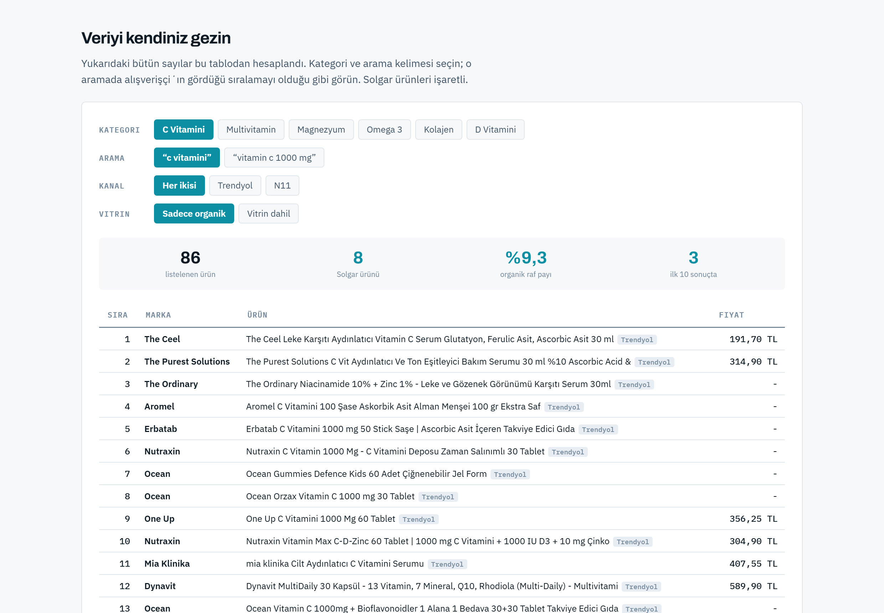

# RafRadar

[](LICENSE)
[](COMMERCIAL.md)
[](https://www.python.org/)
[](#mimari)
[](#gereksinimler)
[](https://github.com/FlyerFukas/rafradar/actions/workflows/testler.yml)

**Bir markanın e-ticaret arama sonuçlarındaki görünürlüğünü ölçen dijital raf denetim aracı.**

🇬🇧 **English version: [README.md](README.md)**

> **Lisans, tek cümlede.** Kişisel, akademik ve ticari olmayan kullanım
> ücretsiz. Bir işletme içinde, bir müşteri için ya da bir ürüne gömerek
> kullanmak ayrı bir ticari lisans gerektirir — bkz.
> **[COMMERCIAL.md](COMMERCIAL.md)**. Sormak ücretsiz.

Perakendede "raf payı" ölçülür: ürün rafta var mı, göz hizasında mı, ne kadar yer
kaplıyor, fiyatı doğru mu. RafRadar aynı soruları **online rafa** sorar; çünkü
fiziksel rafta göz hizası neyse, dijital rafta arama sonuçlarının ilk sayfası odur.

Trendyol ve N11'de kategori aramaları yürütür, çıkan her ürünün markasını, fiyatını
ve kaçıncı sırada göründüğünü kaydeder, sonra bunu okunabilir bir panoya ve PDF
rapora dönüştürür.

> Markanızı arayan sizi bulur. Kategoriyi arayan bulamıyorsa, yeni müşteri kazanma
> kanalınız kapalı demektir. RafRadar bu farkı sayıyla gösterir.


<sub>Örnek çıktı: `yapilandirma/ornek-takviye.json` ile yapılan gerçek bir tarama.
Kullanılan marka ve kategoriler yapılandırmadan gelir.</sub>

---

## Ne buldu (örnek çalıştırma)

Yukarıdaki pano gerçek bir taramadan geliyor: bir takviye markası, altı kategori,
24 arama, 1.222 ürün. Ürettiği sayılar:

| Kategori | Raf payı | Göz hizası | Rafı alan |
|---|---:|---:|---|
| Multivitamin | %0,6 | 0/1 | Nutraxin (33 ürün) |
| Kolajen | %1,1 | 0/2 | Nutraxin (28) |
| D Vitamini | %3,4 | 1/5 | Ocean (27) |
| Omega 3 | %4,5 | 0/5 | Ocean (17) |
| Magnezyum | %4,6 | 2/8 | Nutraxin (23) |
| C Vitamini | %10,3 | 8/18 | Nutraxin (17) |

**Ortalama organik raf payı: %4,1.** Üç kategoride markanın ürünü listede var ama
hiçbiri ilk 10'a giremiyor — bu bir bulunurluk değil sıralama problemi ve araç
bunu ayrıca söylüyor.

Taramanın ürettiği başlık bulgu:

> **"solgar"** araması 72 ürün getiriyor. **"multivitamin"** araması 36 sonuç
> getiriyor ve içinde **tek bir tane** marka ürünü yok.

Aradaki fark işin özü: markayı zaten bilen buluyor, bilmeyen bulamıyor. Yani marka
mevcut müşterisini koruyor ama kategoriden yeni müşteri kazanamıyor.

📄 Üretilen tam rapor: [`cikti/Solgar-dijital-raf.pdf`](cikti/Solgar-dijital-raf.pdf)

Panonun içinde özetin dayandığı veri de var. Kategori ve arama kelimesi seçince o
aramada alışverişçinin gördüğü sıralamayı olduğu gibi görüyorsunuz; izlenen markanın
ürünleri işaretli ve metrikler seçime göre yeniden hesaplanıyor.



## Ne ölçer

| Metrik | Karşılığı |
|---|---|
| **Bulunurluk** | Kategori aramasında markanın ürünü çıkıyor mu? |
| **Görünürlük** | İlk 10 organik sonuçta mı? (*dijital göz hizası*) |
| **Raf payı** | Marka ürün sayısı / organik sonuç sayısı |
| **Fiyat endeksi** | Marka medyan fiyatı / kategori medyan fiyatı |

Bunlara ek olarak:

- **Reklam baskısı** — arama sayfasındaki vitrin/sponsorlu yerleşimleri kim almış
- **Arama kelimesi tuzağı** — aynı kategoride kelimeye göre görünürlük nasıl değişiyor
- **Marka araması / kategori araması farkı** — marka adıyla bulunup kategoriyle bulunamama

Aksiyon önerileri elle yazılmaz; **taramanın kendisinden üretilir.** Bir kategoride
bulunurluk sıfırsa, sıralama ilk 10'a giremiyorsa ya da vitrin alanını tümüyle
rakipler almışsa ilgili madde otomatik doğar ve kanıtı olarak hangi ölçümden çıktığı
yazılır.

---

## Hızlı başlangıç

```bash
git clone https://github.com/FlyerFukas/rafradar.git
cd rafradar
py -m pip install -r requirements.txt
cp yapilandirma/ornek-takviye.json yapilandirma/aktif.json
```

Sonra kontrol panelini açın:

```bash
py src/panel.py
```

Windows'ta `PANELI-BASLAT.bat` dosyasına çift tıklamak da yeterlidir. Tarayıcıda
`http://localhost:8000` açılır: adımları tek tek veya tüm akışı tek tuşla
çalıştırır, çıktıyı canlı izler, üretilen pano ile PDF'i oradan açarsınız.

Panel yalnızca kendi bilgisayarınızdan erişilebilir ve Python standart kütüphanesi
dışında bağımlılık istemez.


Her adımın altında en son ürettiği dosya, boyutu ve saati yazılıdır. Tarama yapıp
panoyu yeniden üretmeyi unutursanız panel bunu fark eder ve "güncel değil" diye
işaretler.

### Komut satırını tercih ederseniz

```bash
py src/topla.py               # tarama
py src/analiz.py              # skor kartını hesapla
py src/marka_vs_kategori.py   # marka araması / kategori araması testi
py src/pano.py                # panoyu üret -> cikti/pano.html
```

---

## Kendi markanızı tanımlama

Marka ve kategoriler koda gömülü değildir; `yapilandirma/` altındaki bir JSON
dosyasından okunur. Hazır örnekleri kopyalayıp düzenlemeniz yeterli:

```bash
cp yapilandirma/ornek-takviye.json yapilandirma/aktif.json
```

```json
{
  "ad": "Solgar",
  "pazar": "Türkiye",
  "kanallar": ["n11", "trendyol"],
  "goz_hizasi": 10,

  "markalar": {
    "Solgar": ["solgar"]
  },

  "kategoriler": {
    "C Vitamini": {
      "aramalar": ["c vitamini", "vitamin c 1000 mg"],
      "markalar": ["Solgar"],
      "marka_aramasi": "solgar"
    }
  }
}
```

| Alan | Anlamı |
|---|---|
| `ad` | Raporda görünen izlenen taraf |
| `markalar` | Marka adı → ürün adında aranacak anahtar kelimeler |
| `kategoriler` | Kategori adı → hangi kelimelerle aranacağı |
| `goz_hizasi` | Kaçıncı sıraya kadar "göz hizası" sayılacağı |
| `haric_markalar` | Bilinçli olarak analiz dışı bırakılanlar ve sebebi |

Yapılandırmayı doğrulamak için:

```bash
py src/ayarlar.py
```

Birden fazla yapılandırmayı bir arada tutup `RAFRADAR_AYAR` ortam değişkeniyle
seçebilirsiniz.

### `haric_markalar` niçin var

Bazı ürünlerin online rafta bulunmaması bir eksiklik değil, zorunluluktur.
Örneğin Türkiye'de ruhsatlı beşeri tıbbi ürünlerin internetten satışı yasaktır;
bunları analize dahil etmek ortalama raf payını yapay olarak düşürür. Bu alan,
öyle ürünleri sebebiyle birlikte ayırmanızı sağlar ve rapor onları ayrı bölümde
gösterir. Örneği `yapilandirma/ornek-eczane-kanali.json` içinde bulabilirsiniz.

---

## Mimari

```
src/
  ayarlar.py             Yapılandırma yükleyici ve marka eşleme
  kanal_n11.py           N11 adaptörü (JSON-LD ItemList)
  kanal_trendyol.py      Trendyol adaptörü (Firecrawl + element ayrıştırma)
  topla.py               Çok kanallı tarama
  analiz.py              Skor kartı motoru (organik / sponsorlu ayrımlı)
  marka_vs_kategori.py   Marka araması ile kategori aramasının karşılaştırması
  pano.py + sablon.html  HTML pano üreteci
  panel.py + panel.html  Yerel kontrol paneli
testler/                 Birim testler (stdlib unittest)
yapilandirma/            Marka ve kategori tanımları (JSON)
veri/                    Ham tarama çıktıları
cikti/                   Hesaplanmış skorlar, pano, PDF
```

Her adım çıktısını diske yazar, sonraki adım onu okur. Böylece tarama bir kez
yapılır, analiz istediğiniz kadar tekrar çalıştırılabilir.

Yeni bir satış kanalı eklemek için `ara(kelime)` fonksiyonu olan ve
`{kanal, arama, urunler[]}` döndüren bir modül yazıp `topla.py`'ye tanıtmak yeterlidir.

### Neden dil modeli kullanılmıyor

Raf payı, fiyat endeksi ve sıralama gibi sayıların tamamı saf Python ile hesaplanır.
Ticari bir karara girecek bir sayının üretilme biçimi denetlenebilir olmalıdır;
bu yüzden hesaplama katmanında dil modeli yoktur. Aracın "akıllı" tarafı, kuralların
veriye uygulanmasıdır — tahmin değil.

---

## Veri kalitesi kararları

Aşağıdakiler geliştirme sırasında fark edilip düzeltilmiş gerçek hatalardır ve
sayıların neden güvenilir olduğunu açıklar.

**Sponsorlu yerleşim ayrıştırılır.** Trendyol arama sayfalarındaki kaydırmalı
vitrin blokları organik sonuç değil, satın alınmış alandır. Ayrıştırılmadığında
raf payı yapay olarak yüksek çıkar; ayrı metrik olarak raporlanır.

**Fiyat, metinden değil elementten okunur.** Ürün kartında satış fiyatı, üstü
çizili liste fiyatı ve birim fiyat birlikte geçer — örneğin
`649,90 TL ( 5.415,83 TL/kg ) 617,40 TL`. Düzenli ifadeyle okumak birim fiyatı
seçebiliyordu; fiyatlar `div.price-section` elementinden alınır, `span.unit-price`
bilinçli olarak elenir.

**Sıralama rozetleri temizlenir.** Trendyol ürün adlarının başına "En 5. Ürün",
"Yetkili Satıcı" gibi etiketler ekler; bunlar ürün adının parçası değildir.

**Kişisel veri toplanmaz.** Yalnızca ürün adı, marka, fiyat ve sıra bilgisi işlenir.
Kullanıcı profilleri, yorum yazarları veya satıcı kişisel bilgileri kaydedilmez.

**Bayat çıktı uyarılır.** Panel her adımın çıktısını dayandığı adımla karşılaştırır;
tarama yapıp panoyu yeniden üretmeyi unutursanız uyarır.

---

## Bilinen sınırlar

- **Tek zaman noktası.** Bir tarama anlık fotoğraftır; asıl değer düzenli tekrarla
  ortaya çıkar. Çıktılar tarih damgalı kaydedilir, trend altyapısı hazırdır.
- **Arama sonuçları kişiselleştirilebilir.** Konuma ve geçmişe göre değişebilir;
  taramalar oturumsuz yapılır ama birebir aynı sonuç garanti edilemez.
- **İlk sayfa ile sınırlıdır.** Bu bilinçli bir tercihtir: alışverişçinin gördüğü
  raf ilk sayfadır.
- **Trendyol için Firecrawl gerekir.** Site bot koruması kullandığından doğrudan
  istek çalışmaz. N11 kanalı ek bir şey istemez, ücretsiz çalışır.
- **Satış verisiyle ilişkilendirmez.** Raf payı ile gerçek satış arasındaki bağ
  için şirket içi veri gerekir.

---

## Gereksinimler

- Python 3.9+
- `requests`, `beautifulsoup4`
- PDF çıktısı için Chrome veya Edge (sistemde kuruluysa otomatik bulunur)
- Trendyol kanalı için [Firecrawl CLI](https://firecrawl.dev) (N11 için gerekmez)

## Katkı

En değerli katkı yeni kanal adaptörü; ayrıntı için [CONTRIBUTING.md](CONTRIBUTING.md).
Testler: `python -m unittest discover -s testler`

## Lisans

**Çift lisanslı.** Kaynak kodu herkese açıktır; bu, serbestçe
ticarileştirilebileceği anlamına gelmez.

**Ücretsiz — [PolyForm Noncommercial 1.0.0](LICENSE)**
Kişisel öğrenme ve deneme, hobi projeleri, akademik araştırma, eğitim kurumları,
kamu kurumları, hayır kurumları. İzin almanıza gerek yok. Tek yükümlülük:
yazılımı başkasına verirken lisans metnini ve telif bildirimini birlikte vermek.

**Ücretli — ticari lisans gerekir**
Bir işletme tarafından ya da onun için yapılan her kullanım ticaridir: kendi
markasını izleyen bir şirket, müşterisi için çalıştıran bir ajans, ürüne veya
SaaS'a gömme, çıktısını satma, üzerine ücretli hizmet kurma. Koşullar, lisans
biçimleri ve iletişim: **[COMMERCIAL.md](COMMERCIAL.md)**. Fiyat pazarlığa
açıktır; erken aşama girişimler ve küçük ajanslar için indirimli koşullar vardır.

Ticari lisans almadan ticari kullanım bir telif hakkı ihlalidir.

Mimari, kaynak kod ve belgeler **Furkan Akduman**
([@FlyerFukas](https://github.com/FlyerFukas)) tarafından üretilmiştir.

Güvenlik politikası: [SECURITY.md](SECURITY.md). Katkı koşulları (katkıların
lisanslanmasına dikkat): [CONTRIBUTING.md](CONTRIBUTING.md). Güvenlik politikası: [SECURITY.md](SECURITY.md).

---

<sub>Bu araç halka açık arama sonuçlarını okur ve yalnızca ürün, marka, fiyat ve
sıralama bilgisi işler. Kullanımı, hedef sitelerin kullanım koşullarına uygunluk
sorumluluğu kullanıcıya aittir.</sub>
